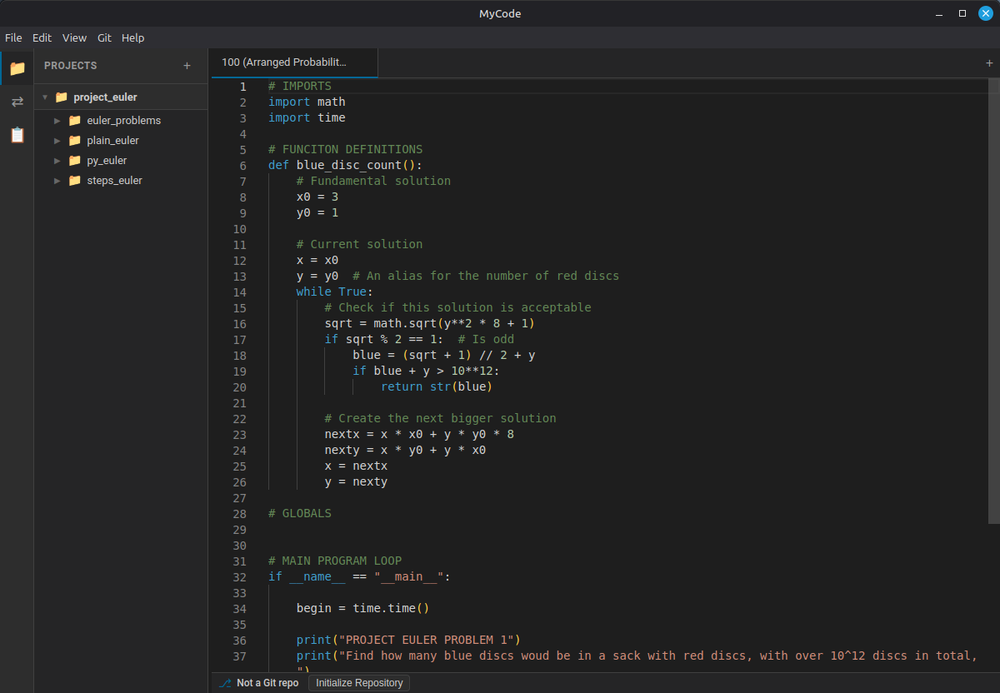

# MyCode - Cross-Platform Code Editor



A modern, cross-platform code editor inspired by Elementary Code, built with Electron and Monaco Editor. Features a powerful plugin system for extensibility.

## Features

### Core Editor
- **Monaco Editor** with syntax highlighting for 50+ languages
- **Multi-tab editing** with session restore
- **Smart cut/copy** - copies entire line when no selection
- **Line operations** - duplicate (`Ctrl+D`), sort (`F5`), clear (`Ctrl+K`)
- **Comment toggling** (`Ctrl+/`)
- **Navigation marks** - set marks and jump between them (`Alt+=`, `Alt+←/→`)
- **Case transform** - lowercase (`Ctrl+L`), uppercase (`Ctrl+U`)

### Project Sidebar
- **Folder tree view** with expand/collapse
- **Multi-project support** - open multiple folders simultaneously
- **File icons** for 30+ file types
- **Context menu** - New File, New Folder, Rename, Delete
- **File monitoring** for external changes

### Search & Replace
- **Real-time highlighting** as you type
- **Match counter** ("3 of 15")
- **Regex support** with pattern matching
- **Case sensitivity** - auto-detect mixed case
- **Whole word matching**
- **Replace and Replace All**

### Integrated Terminal
- **Full terminal emulation** using xterm.js
- **Multiple terminal sessions**
- **Project-aware** working directory

### Git Integration
- **Branch display** in status bar
- **Gutter decorations** showing line changes (added/modified/deleted)
- **Commit dialog** with staged changes
- **File status** in sidebar

### Markdown Preview
- **Live preview** side-by-side with editor
- **Scroll synchronization** between editor and preview
- **Theme-aware** styling

### Plugin System
- **Extensible architecture** with Plugin API
- **Built-in plugins**: Symbol Outline, Diff Viewer, JSON Formatter
- **Plugin Manager** UI for enabling/disabling plugins
- **Hook system** for formatters, linters, and event handlers
- **UI extensions** - sidebar panels, status bar items, notifications

### Preferences
- **Comprehensive settings** dialog
- **Editor customization** - font, theme, tab size, word wrap
- **Behavior settings** - auto-save, format-on-save, smart features

## Tech Stack

- **Framework**: Electron 28+
- **Editor**: Monaco Editor (bundled locally)
- **Language**: TypeScript
- **Terminal**: xterm.js + node-pty
- **Git**: simple-git
- **Build**: esbuild + electron-builder

## Getting Started

### Quick Setup (Recommended)

Run the setup script to automatically detect and configure your environment:

```bash
./scripts/setup.sh
```

### Option 1: Nix Flakes (Best for Multi-PC Development)

If you move between multiple dev machines, **Nix** provides a completely reproducible environment with all dependencies (Node.js, npm, and Electron system libraries).

```bash
# Install Nix (one-time setup per machine)
curl --proto '=https' --tlsv1.2 -sSf -L https://install.determinate.systems/nix | sh -s -- install

# Enter the dev environment
nix develop

# Install npm packages and start developing
npm install
npm run dev
```

**Tip:** Install [direnv](https://direnv.net/) for automatic shell activation:
```bash
# After installing direnv, run once:
direnv allow
# Now the Nix shell activates automatically when you cd into the project!
```

### Option 2: System Node.js

If you prefer using your system's Node.js:

```bash
# Ubuntu/Debian
sudo apt install nodejs npm

# Fedora
sudo dnf install nodejs npm

# Arch Linux
sudo pacman -S nodejs npm

# macOS (Homebrew)
brew install node

# Then install dependencies and run
npm install
npm run dev
```

### Option 3: nvm (Node Version Manager)

```bash
# Install nvm
curl -o- https://raw.githubusercontent.com/nvm-sh/nvm/v0.39.7/install.sh | bash

# Install and use Node.js 20
nvm install 20
nvm use 20

# Install dependencies and run
npm install
npm run dev
```

### Development Commands

```bash
npm run dev      # Start development mode (watch + compile)
npm run build    # Build for production
npm start        # Run the compiled app
npm run pack     # Package for current platform (unpacked)
npm run dist     # Build distributable installers
```

## Keyboard Shortcuts

### File Operations
| Action         | Shortcut       |
| -------------- | -------------- |
| New Tab        | `Ctrl+N`       |
| Open File      | `Ctrl+O`       |
| Open Folder    | `Ctrl+Shift+O` |
| Save           | `Ctrl+S`       |
| Save As        | `Ctrl+Shift+S` |
| Close Tab      | `Ctrl+W`       |
| Quit           | `Ctrl+Q`       |

### Editing
| Action           | Shortcut       |
| ---------------- | -------------- |
| Duplicate Line   | `Ctrl+D`       |
| Toggle Comment   | `Ctrl+/`       |
| Sort Lines       | `F5`           |
| Clear Line       | `Ctrl+K`       |
| Lowercase        | `Ctrl+L`       |
| Uppercase        | `Ctrl+U`       |
| Add Nav Mark     | `Alt+=`        |
| Previous Mark    | `Alt+←`        |
| Next Mark        | `Alt+→`        |

### Search
| Action         | Shortcut       |
| -------------- | -------------- |
| Find           | `Ctrl+F`       |
| Find Next      | `Ctrl+G`       |
| Find Previous  | `Ctrl+Shift+G` |
| Replace        | `Ctrl+R`       |

### View
| Action           | Shortcut       |
| ---------------- | -------------- |
| Toggle Sidebar   | `F9`           |
| Toggle Terminal  | `Ctrl+``       |
| Toggle Preview   | `Ctrl+Shift+P` |
| Fullscreen       | `F11`          |
| Zoom In          | `Ctrl++`       |
| Zoom Out         | `Ctrl+-`       |
| Reset Zoom       | `Ctrl+0`       |

## Project Structure

```
MyCode/
├── package.json
├── tsconfig.json
├── electron-builder.yml
├── src/
│   ├── main/                    # Electron main process
│   │   ├── main.ts              # App lifecycle, window creation
│   │   ├── menu.ts              # Native menus with shortcuts
│   │   ├── ipc.ts               # IPC channel handlers
│   │   ├── preload.ts           # Context bridge for renderer
│   │   ├── plugins/             # Plugin system (main process)
│   │   └── services/            # Backend services
│   │       ├── fileService.ts
│   │       ├── settingsService.ts
│   │       ├── gitService.ts
│   │       └── terminalService.ts
│   ├── renderer/                # Browser/UI code
│   │   ├── index.html
│   │   ├── index.ts
│   │   ├── App.ts               # Main application controller
│   │   ├── editor/              # Monaco editor wrapper
│   │   ├── sidebar/             # Folder tree view
│   │   ├── search/              # Search bar
│   │   ├── terminal/            # Integrated terminal
│   │   ├── git/                 # Git UI components
│   │   ├── preview/             # Markdown preview
│   │   ├── preferences/         # Settings dialog
│   │   └── plugins/             # Plugin system (renderer)
│   │       └── contrib/         # Built-in plugins
│   └── shared/                  # Shared types
│       ├── types.ts
│       ├── ipc-channels.ts
│       └── plugin-types.ts
├── resources/                   # Icons and assets
└── docs/                        # Documentation
    ├── USER_GUIDE.md            # User documentation
    ├── PLUGIN_DEVELOPMENT_GUIDE.md  # Plugin developer guide
    └── ...
```

## Documentation

- **[User Guide](docs/USER_GUIDE.md)** - Complete guide to using MyCode
- **[Plugin Development Guide](docs/PLUGIN_DEVELOPMENT_GUIDE.md)** - How to create plugins
- **[Plugin System Plan](docs/PLUGIN_SYSTEM_PLAN.md)** - Technical architecture

## License

GPL-3.0 (matching Elementary Code license)
